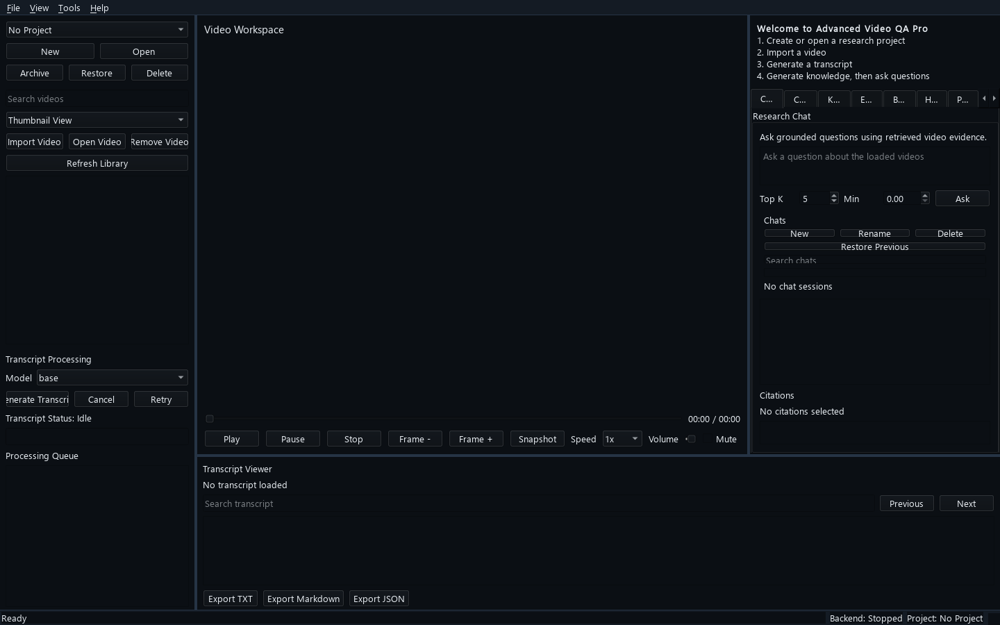
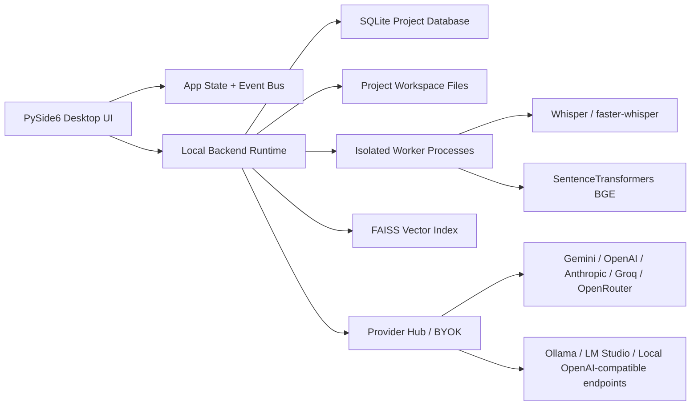

# Advanced Video QA Pro

Advanced Video QA Pro is a local-first desktop workbench for researching video content. It imports local videos, generates transcripts, structures knowledge, builds local embeddings and FAISS indexes, retrieves evidence, answers questions with citations, and compares concepts across multiple videos.

The product is designed for Windows desktop use with a PySide6 interface and a local runtime. Cloud deployment is not required. AI provider access is BYOK (bring your own key), and local model workflows are supported where installed and configured.



## Latest Improvements

- Improved chat UX
- Structured chat diagnostics
- Actionable error reporting
- Improved transcription recovery
- Retrieval quality audit completed

## Features

- **Research Projects** — project-scoped videos, chats, evidence, bookmarks, highlights, exports, and settings.
- **Video Library** — import local videos, extract metadata, generate thumbnails, and manage project media.
- **Video Playback** — play, pause, seek, control speed, frame-step, and export snapshots.
- **Transcripts** — generate timestamped transcripts with Whisper/faster-whisper, view/search/export transcript segments, and sync with playback.
- **Knowledge Structuring** — convert transcript segments into semantic knowledge chunks with topic titles.
- **Local Retrieval** — generate BGE embeddings, persist embeddings in SQLite, build FAISS indexes, and run similarity search.
- **Evidence Panel** — inspect source video, timestamp, chunk, score, confidence, and retrieval rank.
- **Research Chat** — ask grounded questions over loaded video evidence with citation-backed responses.
- **Multi-Video Compare** — compare agreements, differences, unique concepts, missing topics, contradictions, and timeline differences across multiple videos.
- **Research Workflow Tools** — bookmarks, highlights, prompt templates, exports, diagnostics, provider dashboard, and runtime profiles.

## Architecture



### Main Layers

- `desktop_app/` — PySide6 desktop application, widgets, state, runtime, and product workflows.
- `desktop_app/database/` — SQLite connection, schema, migrations, and repositories.
- `desktop_app/projects/` — research project lifecycle and persistence.
- `desktop_app/videos/` — video import, metadata, thumbnails, and library management.
- `desktop_app/transcripts/` — transcription pipeline and transcript persistence.
- `desktop_app/knowledge/` — semantic chunking and topic extraction.
- `desktop_app/embeddings/` — local embedding generation and persistence.
- `desktop_app/vector_store/` — FAISS index management.
- `desktop_app/retrieval/` — query embedding, vector search, ranking, and retrieval history.
- `desktop_app/evidence/` — evidence ranking, history, and evidence panel integration.
- `desktop_app/answering/` and `desktop_app/chat/` — grounded answer generation and persistent chat sessions.
- `desktop_app/compare/` — multi-video comparison sessions and result rendering.
- `desktop_app/providers/` — provider profiles, health checks, routing, and encrypted credential handling.
- `desktop_app/workers/` — isolated process workers for heavyweight model execution.
- `packaging/` — PyInstaller and Windows installer configuration.

## Installation

### Recommended: Windows Installer

1. Download the latest `AdvancedVideoQAProSetup.exe` from GitHub Releases.
2. Run the installer.
3. Launch **Advanced Video QA Pro** from the Start Menu or desktop shortcut.
4. Complete the first-run setup:
   - Choose a project workspace folder.
   - Select a runtime profile.
   - Configure local or cloud AI providers if needed.

### Development Run

```powershell
python -m venv .venv
.\.venv\Scripts\Activate.ps1
pip install -r requirements.txt
python desktop_app/main.py
```

### Build EXE

```powershell
python -m PyInstaller packaging/AdvancedVideoQAPro.spec --noconfirm --clean
```

The Windows installer configuration is in `packaging/AdvancedVideoQAPro.iss`.

### Direct Download link

```powershell
https://github.com/hammad986/advanced-Video-QA-System/releases/download/v1.0.0-rc.1/AdvancedVideoQAProSetup-1.0.0.exe
```

https://github.com/hammad986/advanced-Video-QA-System/releases/download/v1.0.0-rc.1/AdvancedVideoQAProSetup-1.0.0.exe

## Usage

1. Create or open a research project.
2. Import one or more videos into the Video Library.
3. Generate transcripts for selected videos.
4. Generate knowledge chunks and embeddings.
5. Build or refresh the FAISS vector index.
6. Search evidence, ask grounded questions, or compare videos.
7. Export chats, compare sessions, evidence, bookmarks, highlights, or reports.

## Hardware Requirements

| Profile | RAM | Recommended Use |
| --- | ---: | --- |
| Starter | 8 GB | Small projects, Whisper tiny/base, BGE small, aggressive model unloading |
| Standard | 16 GB | Typical research workflow, Whisper small, BGE base |
| Advanced | 32 GB | Larger videos, warmer workers, larger embedding models |
| Workstation | 64 GB+ | Heavy multi-video compare and high-throughput local workflows |

GPU acceleration is optional. CPU-only operation is supported but slower for transcription and embedding generation.

## Provider Model

Advanced Video QA Pro is BYOK. API keys are configured through the desktop Provider Hub and should be stored in encrypted local credential storage. Do not commit `.env` files or secrets to this repository.

Supported provider targets include Gemini, OpenAI, Anthropic, Groq, OpenRouter, Mistral, Hugging Face, Ollama, LM Studio, and OpenAI-compatible local endpoints.

## Known Limitations

- Cloud generation requires user-provided API keys.
- Local model workflows require disk space for downloaded models.
- Large videos can require substantial CPU, RAM, and processing time.
- Clean-machine installer validation should be repeated for every release candidate.
- Update checks require a configured GitHub Releases URL.
- No cloud sync, browser extension, team workspace, or managed cloud backend is included in v1.

## Roadmap

- Signed Windows installer and reproducible release pipeline.
- Expanded clean-machine validation matrix for Windows 10 and Windows 11.
- More provider health checks and capability benchmarks.
- Improved report templates and citation review tools.
- Optional local-model setup assistant.
- Additional UX polish for first-run and large-project workflows.

## Repository Hygiene

This repository intentionally excludes generated/runtime artifacts such as `data/`, `models/`, `tmp/`, `build/`, `dist/`, virtual environments, local databases, logs, model binaries, and video files. Release binaries should be attached to GitHub Releases, not committed to source control.

Powered by Aetherion Labs
